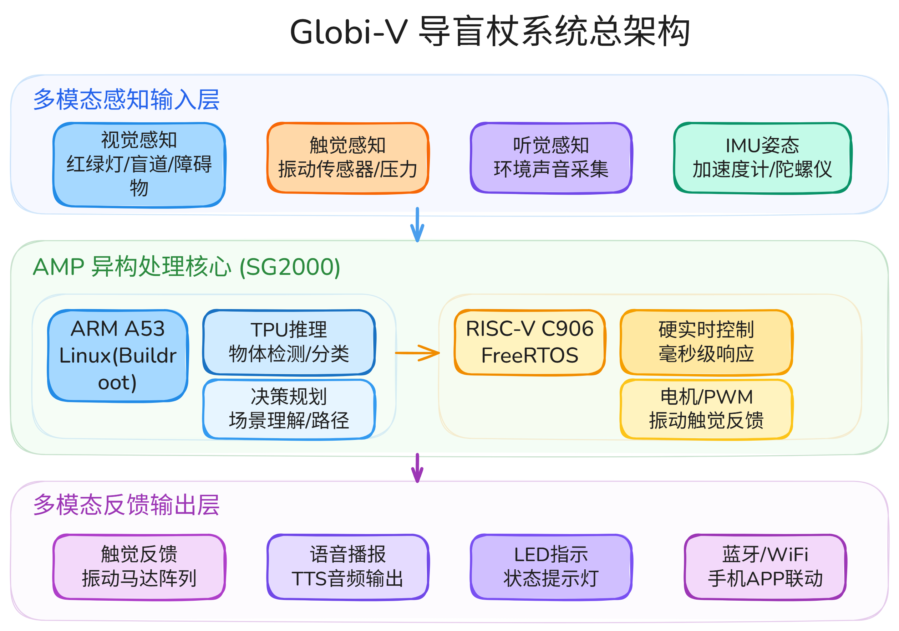
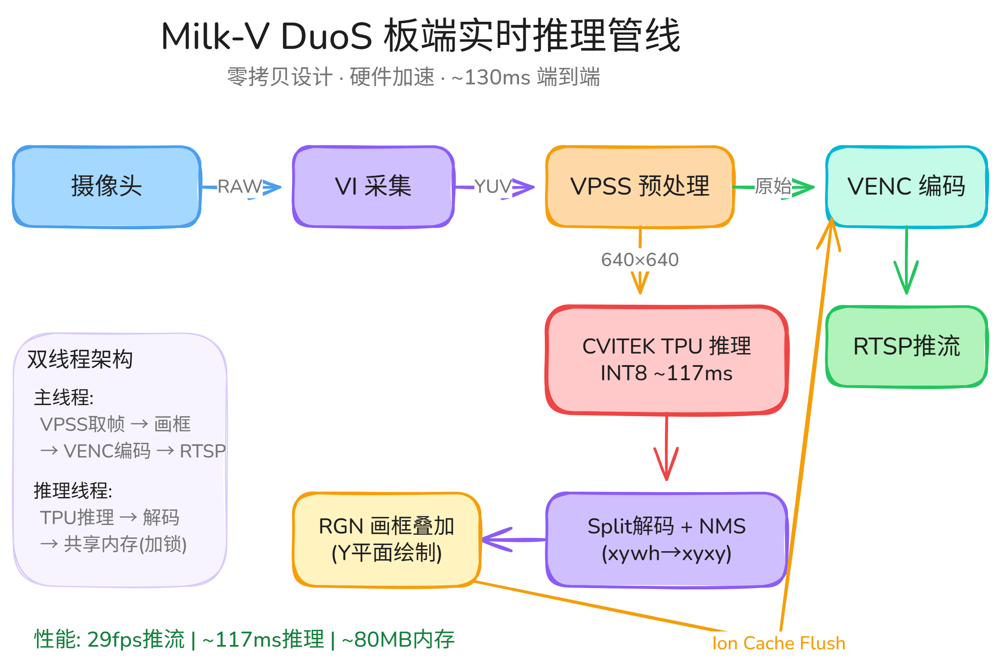
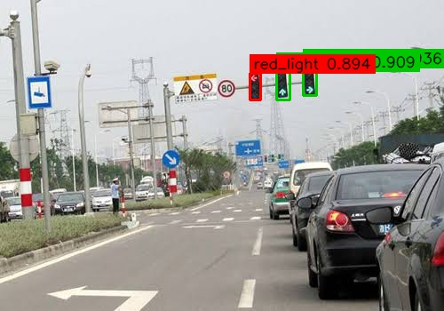
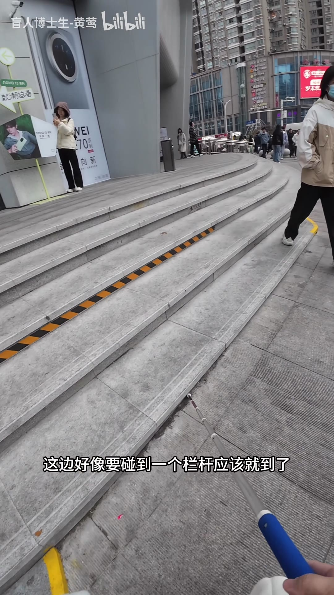

# Globi-V

Globi-V 是一套运行在 Milk-V DuoS（SG2000）上的道路视觉感知原型。项目将交通灯检测、人行横道与导向箭头检测、盲道分割模型部署到板端，并围绕摄像头采集、VPSS 图像处理、TPU 推理和 RTSP 输出建立实时处理链路。



## 项目内容

- **交通灯检测**：训练和导出 YOLOv5 系列模型，在 DuoS 上完成静态图与实时摄像头推理。
- **人行横道与导向箭头检测**：提供模型转换、板端验证和结果标注工具。
- **盲道分割**：提供 YOLOv8 Seg 转换与板端输出解码脚本。
- **板端实时链路**：接入 GC2083 摄像头、VPSS、cviruntime 和 RTSP，并提供异常恢复与部署脚本。

## 仓库结构

```text
board-runtime/   DuoS 板端 C/C++ 运行程序
camera_capture/  独立摄像头采集实验
training/        训练、导出入口和数据集配置示例
tools/           模型转换、评测、标注与设备诊断脚本
docs/            开发基线、部署记录和问题复盘
assets/          架构图、流程图和图片类演示结果
```

详细目录说明见 [WORKSPACE_MAP.md](WORKSPACE_MAP.md)，文档索引见 [docs/README.md](docs/README.md)。

## 核心运行程序

### 静态图验证

[`board-runtime/minimal-cviruntime-runner`](board-runtime/minimal-cviruntime-runner/) 用于验证 `cvimodel` 加载、输入预处理、模型输出和 YOLO 后处理。它适合先排除模型转换或解码问题，再接入摄像头链路。

### 实时摄像头推理

[`board-runtime/traffic-light-live-runner`](board-runtime/traffic-light-live-runner/) 负责 VI、VPSS、TPU 推理和 RTSP 输出。源码将媒体管线与模型推理解码拆开，部署脚本支持基线检查、板端上传和 MMF 恢复。

## 环境要求

本仓库不附带 SDK、模型和数据集。构建或复现前需要准备：

- Milk-V DuoS / DuoS-PoE，目标架构为 RISC-V 64；
- Milk-V Duo Buildroot SDK V2；
- `duo-tdl-examples` 及对应 SG200x 头文件和库；
- TPU-MLIR / DuoTPU 模型转换环境；
- Python 3，以及具体脚本所需的 PyTorch、Ultralytics、OpenCV 或 ONNX Runtime；
- 已训练的 `.pt` / `.onnx` 模型或转换后的 `.cvimodel`。

建议先阅读 [DuoS 开发基线](DUOS_BASELINE.md) 和 [官方开发手册整理](docs/duos-official-development-handbook.md)。上游工具的版本、目录和环境变量需要按本机安装位置配置。

## 常用入口

检查本地 DuoS 基线：

```bash
./tools/check_duos_official_baseline.sh
```

导出交通灯 YOLOv5 模型：

```bash
python3 training/traffic_light_yolov5_export.py --help
```

转换三类模型：

```bash
./tools/build_teammate_yolov5s_cvimodel.sh
./tools/build_crosswalk_guide_arrows_yolov5s_cvimodel.sh
./tools/build_mangdao_yolov8seg_cvimodel.sh
```

构建实时 runner：

```bash
cd board-runtime/traffic-light-live-runner
./build.sh
```

构建命令需要外部 DuoS SDK 与交叉编译工具链。具体变量和板端目录见该模块的 [README](board-runtime/traffic-light-live-runner/README.md)。

## 演示结果

| 系统流程 | 交通灯检测 | 盲道分割 |
| --- | --- | --- |
|  |  |  |

更多架构图、训练与部署流程图、检测结果见 [assets/README.md](assets/README.md)。仓库不上传视频；演示视频保留在项目离线交付资料中。

## 已知边界

- 仓库不包含 `.pt`、`.onnx`、`.cvimodel`、数据集、视频、SDK 和构建产物。
- 部分转换脚本按项目使用的 DuoTPU 容器布局编写，运行前需要调整模型输入路径。
- 板端程序依赖 Milk-V / CVITEK 专有头文件和预编译库，不能只用本仓库完成主机编译。
- 文档中的性能和精度结论对应当时的模型、阈值、固件与测试样本，不能视为通用基准。

## 文档

- [交通灯模型训练](docs/2026-05-04-traffic-light-yolov5s-training.md)
- [TPU-MLIR 转换记录](docs/2026-05-04-traffic-light-yolov5s-tpu-mlir.md)
- [板端验证与后处理](docs/2026-05-04-traffic-light-board-validation-and-yolov5u-note.md)
- [实时推理集成](docs/2026-05-05-process-14-live-inference-integration.md)
- [段错误定位与稳定骨架](docs/2026-05-05-process-12-live-runner-sigsegv-root-cause-and-stable-skeleton.md)
- [重启恢复与 MMF 清理](docs/2026-05-05-process-13-live-runner-restart-recovery-and-mmf-recover.md)

## 许可说明

本仓库暂未添加统一开源许可证。项目代码、上游 SDK/API 和演示素材可能适用不同授权；复用或分发前请分别核对来源与许可。
